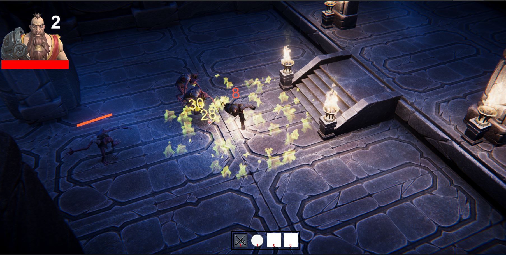
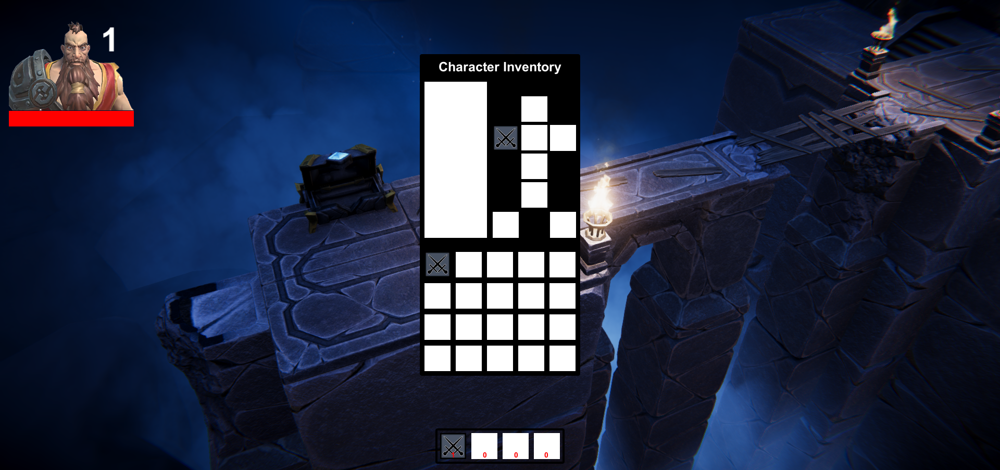
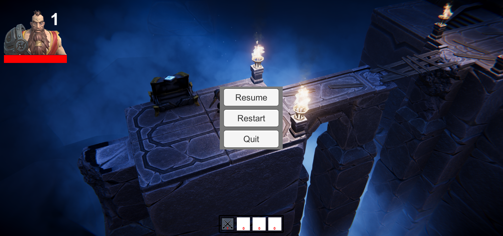
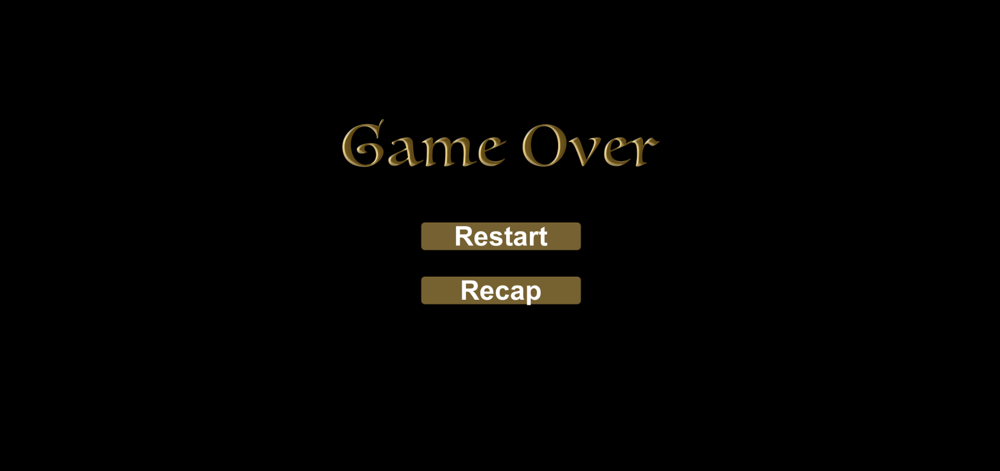

# SwordAndShovels

Beginner-Intermediate-Advance coding course

## Features
  
* Sword and Shovels - Unity learning
* ARPG
  - Movement system
  - Character/Enemy Controller
  - Character/Enemy Stats system
  -  Game/UI/Sound Manager - Managers system
  - Item system
  - Inventory system
  -  Combat system - Diferent weapon/skills for Char/Enemy
  -  Spawner system
  - Save session

## Gameplay
https://play.unity.com/mg/other/webgl-builds-36158

## ScreenShots
&nbsp;&nbsp;&nbsp;&nbsp;&nbsp;&nbsp;&nbsp;&nbsp;&nbsp;

## Sources

* <a href="https://learn.unity.com/">Unity Learn</a> Unity Game Dev Courses

